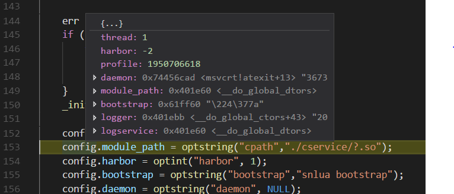

# About this revision of skynet-mingw

The purpose of this revision is for **LEARNING** skynet on **WINDOWS** with **VSCODE** ! it should not be used in production.

Preview:



## vscode configuration


1. Install **C/C++** extension from vscode market
2. Add source code folders as you want
3. launch.json:

    ```
    {
         "name": "(gdb) Launch",
        "type": "cppdbg",
        "request": "launch",
        "program": "your-skynet-mingw-folder\\skynet.exe",
        "args": ["examples\\config"],
        "stopAtEntry": false,
        "cwd": "your-skynet-mingw-folder",
        "environment": [],
        "externalConsole": false,
        "MIMode": "gdb",
        "miDebuggerPath": "c:\\MinGW\\bin\\gdb.exe",
        "setupCommands": [
            {
                "description": "Enable pretty-printing for gdb",
                "text": "-enable-pretty-printing",
                "ignoreFailures": true
            }
        ]
    }
    ```
        
    You should replace `your-skynet-mingw-folder` with your local path.

## Debug tricks

- New breakpoints wont work when the app is already running, so set it up BEFORE you press F5

## Changes

- Disable gcc optimization for easy debugging.


> Original README starting below.

# 关于skynet-mingw [](https://ci.appveyor.com/project/dpull/skynet-mingw)

[skynet-mingw](https://github.com/dpull/skynet-mingw) 是[skynet](https://github.com/cloudwu/skynet)的windows平台的实现。其主要特点是：

1. skynet 以submodule链接，方便升级，**确保不改**。
1. 仅扩展了700行代码，方便维护。
1. 自动更新skynet，自动构建，自动化测试，确保质量。

## 编译
不想自行编译的朋友可访问 [自动构建平台获取最新的构建版本](https://ci.appveyor.com/project/dpull/skynet-mingw/build/artifacts)。

1. 安装 [MinGW](http://sourceforge.net/projects/mingw/files/)
1. 安装 `gcc g++`
1. 安装 `pthread (dev)`
1. 运行 `MinGW\msys\1.0\msys.bat`
1. 运行 `prepare.sh`
1. 运行 `make`

### 常见问题
1. 建议使用 `MinGW\msys\1.0\msys.bat` 进行编译
1. 错误: `gcc: Command not found`, 解决: 修改 `msys\1.0\etc\fstab` 中的 `/mingw` 路径
1. 当提示缺少类似`dlfcn.h`文件时，建议看看头文件搜索路径是否有问题，举个例子`perl(Strawberry Perl)`中有`gcc`程序，同时它注册了系统环境变量

## 测试

```bash
./skynet.exe examples\\config    # Launch first skynet node  (Gate server) and a skynet-master (see config for standalone option)
./3rd/lua/lua examples/client.lua   # Launch a client, and try to input hello.
```

## 已知问题

1. console服务不可用(无法对stdin进行select)， 会提示如下出错信息，暂时没有解决方案。

```bash
stack traceback:
        [C]: in function 'assert'
        ./lualib/socket.lua:361: in function 'socket.lock'
        ./service/console.lua:15: in upvalue 'func'
        ./lualib/skynet.lua:452: in upvalue 'f'
        ./lualib/skynet.lua:105: in function <./lualib/skynet.lua:104>
```

2. 使用`skynet.abort`无法退出，看堆栈卡在了系统中，暂时没有解决方案。（替代方案`os.exit(true)`）

```bash
#0  0x77bd718c in ntdll!ZwWaitForMultipleObjects () from C:\WINDOWS\SYSTEM32\ntdll.dll
#1  0x74c0a4fa in WaitForMultipleObjectsEx () from C:\WINDOWS\SYSTEM32\KernelBase.dll
#2  0x74c0a3d8 in WaitForMultipleObjects () from C:\WINDOWS\SYSTEM32\KernelBase.dll
#3  0x6085be1c in pause () from D:\MinGW\msys\1.0\bin\msys-1.0.dll
#4  0x6085ccf1 in msys-1.0!cwait () from D:\MinGW\msys\1.0\bin\msys-1.0.dll
#5  0x6080dff4 in msys-1.0!cygwin_stackdump () from D:\MinGW\msys\1.0\bin\msys-1.0.dll
#6  0x00413fe5 in ?? ()
#7  0x00413e8f in ?? ()
#8  0x00412a1b in ?? ()
#9  0x0040f77b in ?? ()
#10 0x0040f151 in ?? ()
#11 0x00403869 in __mingw_opendir ()
#12 0x0000000a in ?? ()
#13 0x0069fe30 in ?? ()
#14 0x00000000 in ?? ()
```

## 相关文档
[开发笔记](http://www.dpull.com/blog/2015-11-08-skynet_mingw) 
